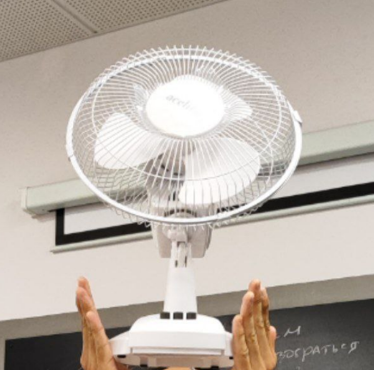

  

<h3 align="center">ContactlessPlaneTesting </h3>

---

 Бесконтактное измерение физических величин: тестируем самолёты на прочность.
      

## 📝 Оглавление

- [ВНИМАНИЕ!!!](#attention)
- [О проекте](#about)
- [Авторы](#authors)

## ВНИМАНИЕ!!! 

Сохраняйте всё в свои папки!!! Чужие папки трогать не стоит.

## 🧐 О проекте 

Проектирование современных самолётов невозможно представить без анализа прочности, который проводится с помощью сложных расчётных моделей. Степень их корректности подтверждается экспериментальным путём: в процессе эксперимента расчётные значения сравниваются со
значениями на реальном физическом объекте. Для проведения такого сравнения требуются методы, позволяющие получать значения деформации конструкции и действующих напряжений в материале в процессе проведения эксперимента. В рамках проекта участникам предлагается
разработать программный аппарат для определения направления и величины деформации образцов из алюминиевого сплава по видеозаписи эксперимента.

## ✍️ Авторы 

- [@ravilkooo](https://github.com/ravilkooo)
- [@ilsurgumerov](https://github.com/ilsurgumerov)
- [@SgAquinski](https://github.com/SgAquinski)

